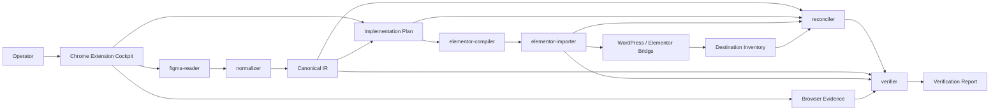

# Arquitetura Logica

## Camadas oficiais do produto

1. `Cockpit`
2. `Ingestion`
3. `Normalization`
4. `Planning`
5. `Execution`
6. `Reconciliation`
7. `Verification`

`Cockpit` nao substitui os modulos de dominio. Ele apenas coordena a sessao, aprovacoes, bridge e evidencias dentro da extensao Chrome.

## Diagrama logico

## Modulos oficiais da fase 01

### `figma-reader`

- responsabilidade: extrair dados relevantes do Figma Web
- entra: `sessionId`, `figmaFileKey`, `figmaNodeId`, contexto do operador
- sai: snapshot bruto e metadados de captura
- nao faz: matching, decisao, escrita

### `normalizer`

- responsabilidade: produzir `Canonical IR` estavel
- entra: snapshot bruto e regras de normalizacao
- sai: IR tipado
- nao faz: escrita, reconciliacao, verificacao visual

### `elementor-compiler`

- responsabilidade: transformar `Implementation Plan` em operacoes seguras do bridge
- entra: plano aprovado e `Capability Matrix`
- sai: lote compilado, correlacionado e idempotente
- nao faz: descoberta de novos alvos, matching, decisao

### `elementor-importer`

- responsabilidade: executar preflight, mutacao e finalizacao contra o bridge
- entra: lote compilado, gatilho de import e credenciais de sessao
- sai: `Execution Report`
- nao faz: interpretar Figma, alterar estrategia, ampliar escopo

### `reconciler`

- responsabilidade: comparar origem, destino e efeitos observados
- entra: IR, plano, inventario do destino e execucao
- sai: delta estruturado, conflitos e deteccao de expansao de escopo
- nao faz: escrever no destino

### `verifier`

- responsabilidade: provar convergencia estrutural, semantica e visual
- entra: IR, execucao, reconciliacao e evidencias do browser
- sai: `Verification Report`
- nao faz: mutacoes

## Invariantes

- nada escreve sem plano aprovado
- nada executa mutacao fora de `allowedMutations`
- toda operacao executavel aponta para um unico alvo
- toda escrita carrega `planId`, `correlationId` e `idempotencyKey`
- verificacao final sempre referencia a execucao correspondente
